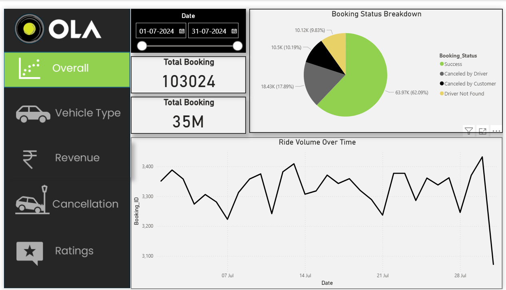
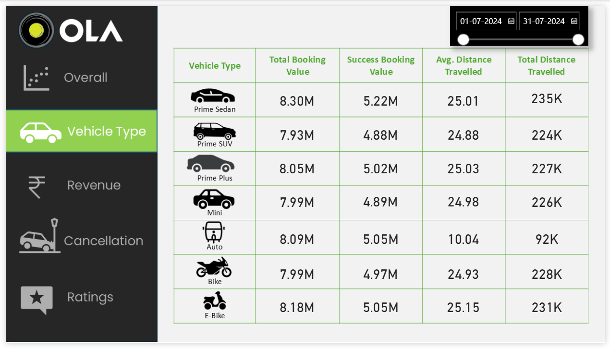
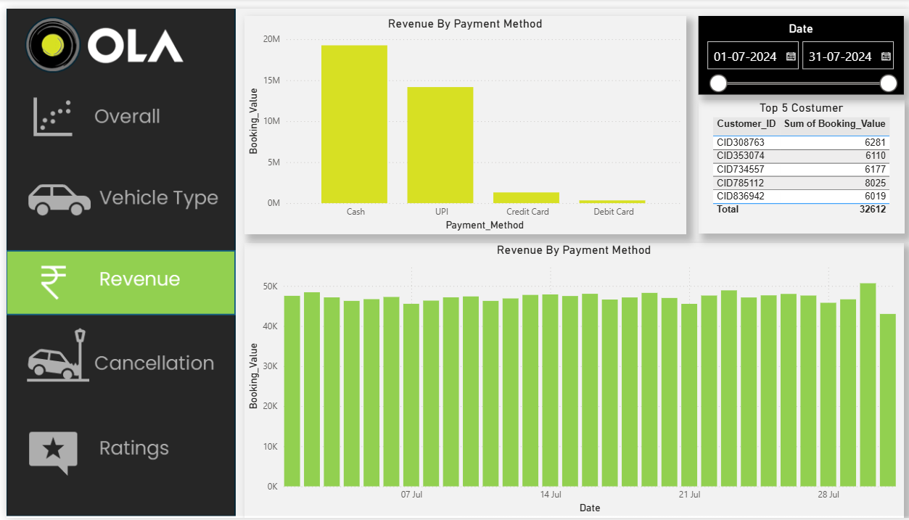
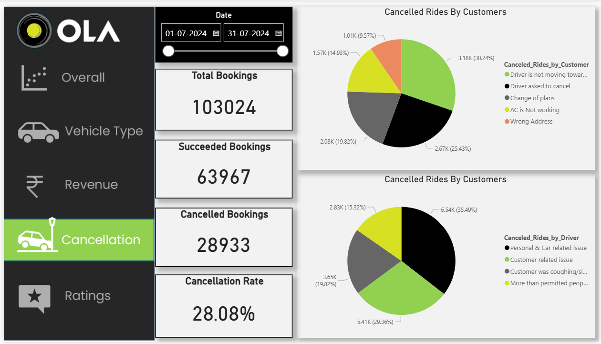
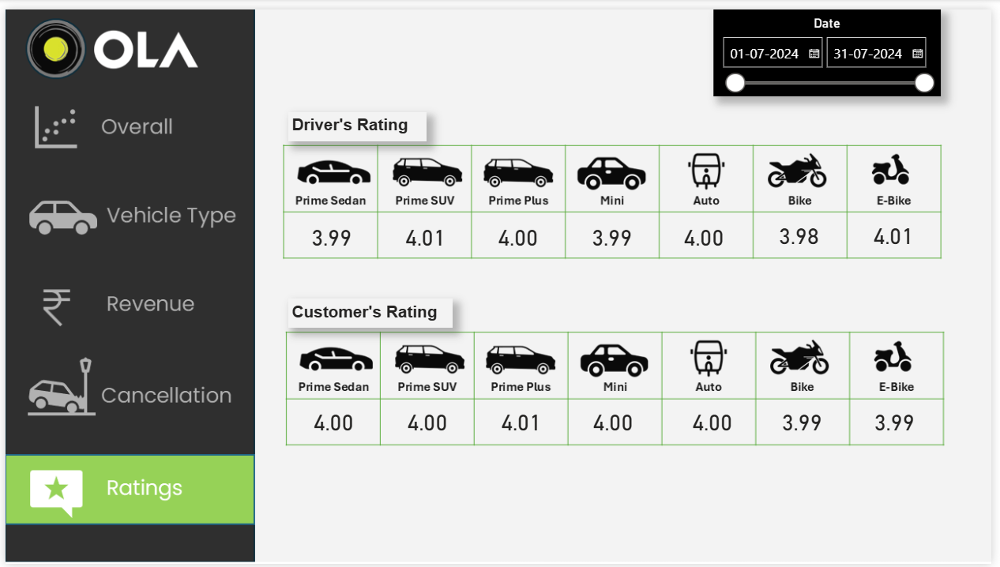

# 🚖 Ola Ride Data Analysis Project  

A **Data Analyst portfolio project** demonstrating the complete analytics workflow using **SQL, Excel, and Power BI**. This project analyzes ride booking data from an Ola-like ride-sharing service to extract insights, identify trends, and support data-driven decision-making.

## 📊 Ola Power BI Project

A showcase of my Ola analytics dashboards and reports.

  

<b>Overall Dashboard</b>

  

<b>Vehicle Type Analysis</b>

  

<b>Revenue Analysis</b>

  

<b>Cancellation Analysis</b>

  

<b>Rating Analysis</b>

## 📌 Business Objective  

To analyze ride data and uncover insights related to:

- Customer booking behavior  
- Ride completion vs cancellations  
- Revenue performance  
- Driver efficiency  
- Vehicle demand patterns  

## 🔄 Analytics Workflow  

### 🗄 SQL – Data Extraction & Cleaning  
- Queried structured datasets  
- Removed duplicates and handled missing values  
- Standardized inconsistent entries  
- Prepared clean data using window functions  

### 📊 Excel – Data Analysis  
- Data sorting and filtering   
- Formula-based analysis  
- Trend and pattern identification  

### 📈 Power BI – Data Visualization  
- Built interactive dashboards  
- Visualized KPIs and performance metrics  
- Presented insights for stakeholders  

## 🛠 Tools & Skills  

**SQL • Excel • Power BI • Data Cleaning • Data Analysis • Data Visualization • Business Intelligence**

## 📊 Key Insights Delivered  

- Ride demand peaks at specific hours  
- Some vehicle types generate higher revenue  
- Cancellation trends affect profitability  
- High-demand locations influence ride distribution  
- Driver performance varies across regions  

## 🎯 Skills Demonstrated  

- Data Cleaning & Preparation  
- Exploratory Data Analysis  
- KPI & Metric Development  
- Dashboard Design  
- Insight Communication  

---
